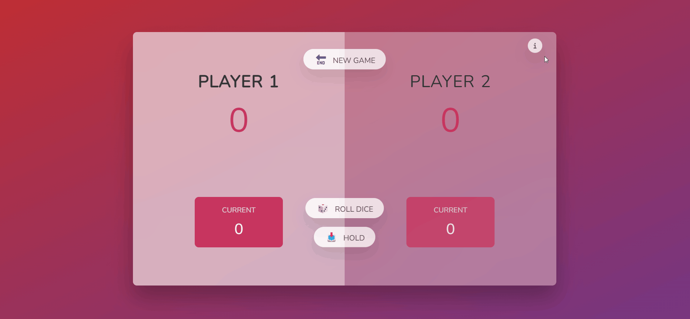

# Pig Game 🐷

### 🎲 About the game

The game of Pig is a very simple jeopardy dice game in which two players race to reach 100 points. Each turn, a player repeatedly rolls a die until either a 1 is rolled or the player holds and scores the sum of the rolls. At any time during a player's turn, the player is faced with two decisions:

#### Roll ─ If the player rolls

👉🏻 1: The player scores nothing and it becomes the opponent's turn.

👉🏻 2 - 6: The number is added to the player's turn total and the player's turn continues

#### HOLD ─ The turn total is added to the player's score and it becomes the opponent's turn.

###### Using for portfolio purpose :link:[Sahil Awasthi](https://linktr.ee/sahilawasthi)
